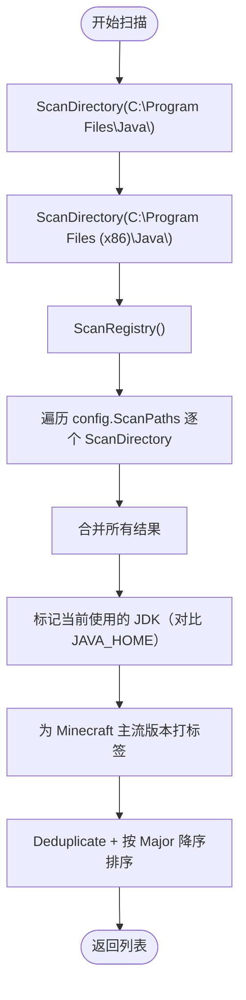
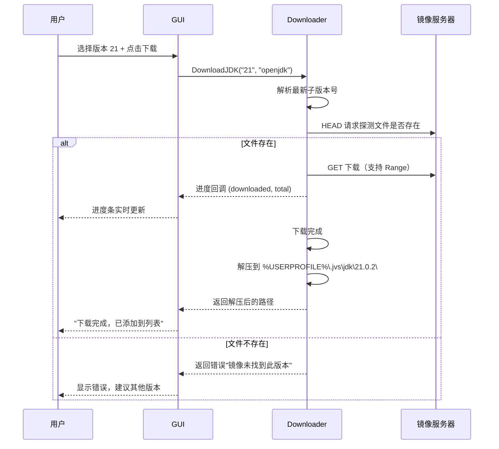
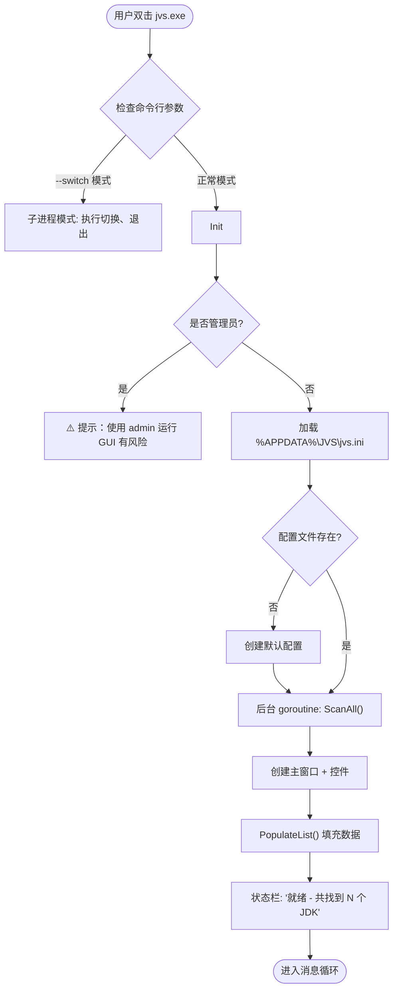
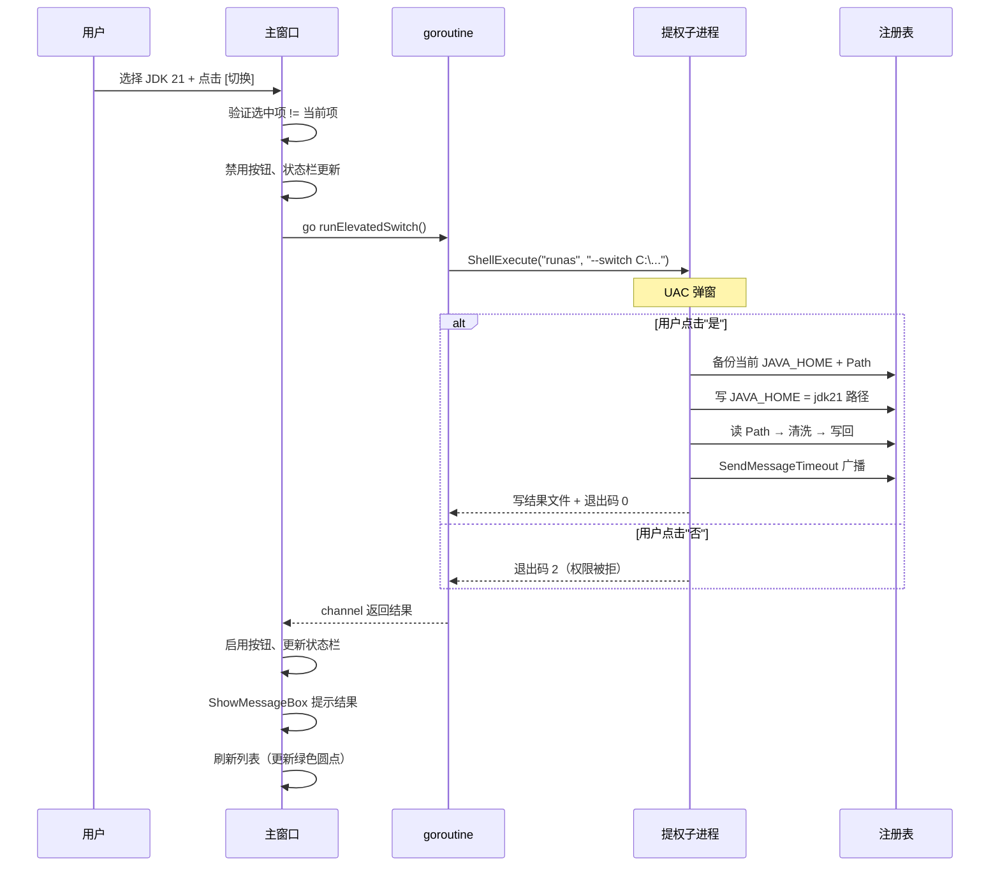

# JVS v1.0 详细功能设计

| 文档版本 | 修改日期   | 作者   | 说明                                 |
| :------- | :--------- | :----- | :----------------------------------- |
| 1.0      | 2026-07-14 | System | 详细功能设计、函数签名与流程图 |

## 1. 数据类型定义

### 1.1 JDK 信息结构体

```go
// JDKInfo 代表扫描到的一个 JDK 实例
type JDKInfo struct {
    Version    string // 完整版本号，如 "17.0.9", "1.8.0_391"（注意 Java 8 的 1.x 格式）
    Major      int    // 主版本号，如 8, 11, 17, 21（用于排序和标签判断）
    Vendor     string // 发行商：Oracle / Zulu / Adoptium / Microsoft / GraalVM
    Path       string // 绝对路径，如 "C:\Program Files\Java\jdk-17.0.9"
    IsCurrent  bool   // 是否为当前 JAVA_HOME 指向的 JDK
    IsPortable bool   // 是否为用户手动添加的便携版
    Tag        string // 附加标签，如 "[Minecraft 推荐]"，空字符串表示无标签
}
```

### 1.2 配置数据

```go
// Config 对应 jvs.ini 的全部内容
type Config struct {
    // [JDK] 段
    ScanPaths  []string // 用户自定义扫描路径列表
    LastUsed   string   // 上次使用的 JDK 路径

    // [Download] 段
    Mirror     string   // 下载镜像 URL
    AutoExtract bool    // 下载后自动解压

    // [UI] 段
    AlwaysOnTop  bool
    StartMinimized bool
}
```

### 1.3 操作结果

```go
// Result 统一返回值
type Result[T any] struct {
    Success bool
    Data    T       // 成功时的数据
    ErrMsg  string  // 失败时的错误描述
    ErrCode int     // 错误码，0=成功
}

// SwitchResult 切换操作详细结果
type SwitchResult struct {
    OldHome  string // 旧的 JAVA_HOME 值
    NewHome  string // 新的 JAVA_HOME 值
    PathCleaned int // 清理了多少条旧 JDK 路径
    BackupPath string // 备份文件路径
}
```

## 2. 模块详细设计

### 2.1 JDK 扫描器 (scanner.go)

#### 函数签名

```go
// ScanAll 执行一次全量扫描，合并所有来源的结果
// 返回去重后的 JDK 列表（路径去重，相同路径只保留版本号最新的）
func ScanAll(config *Config, currentJDK string) []*JDKInfo

// ScanDirectory 扫描单个目录下的所有子目录，查找 JDK
// 支持深度 2 级：直接子目录 和 孙子级（如 C:\Program Files\Java\jdk-17\）
func ScanDirectory(root string) []*JDKInfo

// ScanRegistry 从 Windows 注册表读取已注册的 JDK
// 读取路径：HKLM\SOFTWARE\JavaSoft\JDK 下的每个子键
func ScanRegistry() ([]*JDKInfo, error)

// ResolveVersion 通过执行 java -version 获取准确的版本号
// 输入：JDK 根路径
// 输出：标准化的版本字符串（如 "11.0.22", "1.8.0_391"）
func ResolveVersion(jdkPath string) (string, error)

// Deduplicate 去重：相同路径只保留一个，相同版本号的非便携版优先
func Deduplicate(list []*JDKInfo) []*JDKInfo
```

#### 扫描优先级与流程



#### `ResolveVersion` 实现逻辑

```
输入: C:\Program Files\Java\jdk-21.0.2

1. 检查路径下 bin\java.exe 是否存在 → 不存在返回空
2. 执行 cmd /c "C:\...\java" -version 2>&1
3. 解析输出:
   - 捕获 "openjdk version \"21.0.2\" 2014-07-16"
   - 提取 "21.0.2" 作为 Version
   - 提取 21 作为 Major
   - 提取 "OpenJDK" 或 "Java(TM) SE Runtime" 判断 Vendor
4. 特殊情况 Java 8: 输出为 "1.8.0_391"
   → 统一存储为 "1.8.0_391"，Major 设置为 8
5. 如果执行失败（如 .exe 损坏），标记为 "版本未知"
```

#### 标签规则

```go
func determineTag(major int) string {
    switch major {
    case 8:
        return "[Minecraft 1.12-]"
    case 17:
        return "[Minecraft 1.18-1.20]"
    case 21:
        return "[Minecraft 1.21+]"
    default:
        return ""
    }
}
```

### 2.2 环境变量切换器 (switcher.go)

#### 函数签名

```go
// SwitchJDK 执行 JDK 切换的核心函数
// 参数：jdkPath - 目标 JDK 的绝对路径
// 返回：SwitchResult 包含详细操作信息
// 注意：此函数需要管理员权限，必须在提权后的进程中调用
func SwitchJDK(jdkPath string, backupFile string) (*SwitchResult, error)

// BackupEnvVars 备份当前环境变量到 .reg 文件
func BackupEnvVars(backupFile string) error

// RestoreEnvVars 从 .reg 文件恢复环境变量
func RestoreEnvVars(backupFile string) error

// GetCurrentJAVA_HOME 读取系统级 JAVA_HOME
func GetCurrentJAVA_HOME() string

// GetJDKVersionFromPath 从绝对路径推测 JDK 版本（不执行 java.exe）
// 用于快速判断，精确判断走 ResolveVersion
func GetJDKVersionFromPath(jdkPath string) string

// BroadcastChanged 广播 WM_SETTINGCHANGE 通知系统环境变更
func BroadcastChanged() error
```

#### 核心流程：SwitchJDK

```
输入: jdkPath = "C:\Program Files\Java\jdk-21.0.2"

步骤 1: 备份（写入 .reg 文件）
  - 读取 HKLM\SYSTEM\...\Environment 下的 JAVA_HOME 和 Path
  - 写入 %APPDATA%\JVS\backup\20260714_143022.reg

步骤 2: 校验
  - 检查 jdkPath\bin\java.exe 存在
  - 检查 jdkPath 不是当前 JAVA_HOME（已在 UI 层拦截）

步骤 3: 写 JAVA_HOME
  - registry.WriteString(HKEY_LOCAL_MACHINE,
    "SYSTEM\\CurrentControlSet\\Control\\Session Manager\\Environment",
    "JAVA_HOME", jdkPath)

步骤 4: 清洗并写 Path
  - 读取当前 Path
  - 按 ; 分割为切片
  - 过滤条件: 项中包含 "java\" 或 "jdk\" 或 "jre\"
  - 如果过滤后的 Path 长度 < 100 字符 → 回滚（异常保护）
  - 在最前面插入 "%JAVA_HOME%\bin"
  - 重新 join 写回

步骤 5: 广播
  - SendMessageTimeout(HWND_BROADCAST, WM_SETTINGCHANGE,
    SPIF_SENDCHANGE, "Environment", SMTO_ABORTIFHUNG, 5000)

步骤 6: 更新配置
  - config.LastUsed = jdkPath
  - 持久化到 INI 文件
```

#### Path 清洗详细算法

```go
const javaPathMarkers = []string{"\\java\\", "\\jdk\\", "\\jre\\"}

func CleanPath(path string, oldJdkDir string) (string, int) {
    items := strings.Split(path, ";")
    var cleaned []string
    removed := 0

    for _, item := range items {
        lower := strings.ToLower(item)
        // 跳过空项
        if strings.TrimSpace(item) == "" {
            continue
        }
        // 跳过包含 java/jdk/jre 标记的项
        shouldRemove := false
        for _, marker := range javaPathMarkers {
            if strings.Contains(lower, marker) {
                shouldRemove = true
                break
            }
        }
        // 跳过指向旧 JDK 目录的绝对路径
        if oldJdkDir != "" && strings.HasPrefix(lower, strings.ToLower(oldJdkDir)) {
            shouldRemove = true
        }
        if shouldRemove {
            removed++
            continue
        }
        cleaned = append(cleaned, item)
    }

    // 在最前面插入 %JAVA_HOME%\bin
    result := append([]string{"%JAVA_HOME%\\bin"}, cleaned...)
    return strings.Join(result, ";"), removed
}
```

#### 安全回滚机制

```go
// 安全回滚：在切换过程中如果任何一步失败，自动恢复到备份状态
func safeSwitchJDK(jdkPath string, backupFile string) (result *SwitchResult, err error) {
    // 先备份
    err = BackupEnvVars(backupFile)
    if err != nil {
        return nil, fmt.Errorf("备份失败: %w", err)
    }

    // 切换
    result, err = SwitchJDK(jdkPath, backupFile)
    if err != nil {
        // 切换失败 → 自动回滚
        rollbackErr := RestoreEnvVars(backupFile)
        if rollbackErr != nil {
            return nil, fmt.Errorf("切换失败(%v)且回滚也失败(%v)", err, rollbackErr)
        }
        return nil, fmt.Errorf("切换失败，已自动回滚: %w", err)
    }

    return result, nil
}
```

### 2.3 注册表底层操作 (registry_ops.go)

#### 函数签名

```go
// 全部基于 golang.org/x/sys/windows/registry 封装

// ReadEnvVar 读取系统级环境变量
// 路径：HKLM\SYSTEM\CurrentControlSet\Control\Session Manager\Environment
func ReadEnvVar(name string) (string, error)

// WriteEnvVar 写入系统级环境变量（需要管理员权限）
func WriteEnvVar(name string, value string) error

// ReadRegKey 读取注册表键值（通用）
func ReadRegKey(root registry.Key, path string, name string) (string, error)

// ListSubKeys 列出指定路径下的所有子键名
func ListSubKeys(root registry.Key, path string) ([]string, error)

// DeleteEnvVar 删除系统级环境变量
func DeleteEnvVar(name string) error
```

#### Windows 注册表路径常量

```go
const (
    // 系统环境变量存储路径
    EnvRegPath = `SYSTEM\CurrentControlSet\Control\Session Manager\Environment`

    // JDK 注册信息路径
    JDKRegPath64 = `SOFTWARE\JavaSoft\JDK`           // 64 位 JDK
    JDKRegPath32 = `SOFTWARE\WOW6432Node\JavaSoft\JDK` // 32 位 JDK on 64-bit OS

    // 注册表根键
    HKLM = registry.LOCAL_MACHINE
)
```

### 2.4 下载器 (downloader.go)

#### 函数签名

```go
// DownloadJDK 从指定镜像下载 JDK
// 参数：
//   - version: 主版本号如 "17", "21"，或精确版本号 "17.0.9"
//   - vendor: "oracle" 或 "openjdk"
//   - progress: 进度回调，参数为 (已下载字节, 总字节)
// 返回：下载并解压后的 JDK 目录路径
func DownloadJDK(version, vendor string, progress func(downloaded, total int64)) (string, error)

// ListAvailableVersions 从镜像站获取可下载的 JDK 版本列表
func ListAvailableVersions(mirror string) ([]string, error)

// ExtractArchive 解压 ZIP 或 tar.gz 到目标目录
func ExtractArchive(src string, dest string) error

// GetDownloadURL 根据版本和厂商拼接下载 URL
// 华为云镜像格式：https://repo.huaweicloud.com/java/jdk/{version}/OpenJDK{version}_x64_windows.zip
func GetDownloadURL(version, vendor, mirror string) string
```

#### 镜像源 URL 规则

华为云镜像的 JDK 命名约定：

```
# Oracle JDK
https://repo.huaweicloud.com/java/jdk/21.0.2+9/jdk-21.0.2_windows-x64_bin.zip

# OpenJDK（通用格式）
https://repo.huaweicloud.com/java/jdk/17.0.9+9/openjdk-17.0.9_windows-x64_bin.zip
```

如果华为云镜像失效，备用源：

```
# 阿里云（兼容）
https://mirrors.aliyun.com/adoptium/21.0.2+9/OpenJDK21U-jdk_x64_windows_hotspot_21.0.2_9.zip

# GitHub Releases（直连）
https://github.com/adoptium/temurin21-binaries/releases/download/jdk-21.0.2%2B9/OpenJDK21U-jdk_x64_windows_hotspot_21.0.2_9.zip
```

#### 下载流程



### 2.5 配置文件管理 (config.go)

#### 函数签名

```go
// LoadConfig 从指定路径加载配置，不存在则创建默认配置
func LoadConfig(path string) (*Config, error)

// SaveConfig 持久化配置到 INI 文件
func SaveConfig(cfg *Config, path string) error

// GetConfigPath 获取配置文件的默认路径
// 返回：%APPDATA%\JVS\jvs.ini
func GetConfigPath() string

// GetDefaultConfig 返回默认配置
func GetDefaultConfig() *Config

// UpdateLastUsed 更新上次使用的 JDK 路径并保存
func (c *Config) UpdateLastUsed(jdkPath string) error

// AddScanPath 添加自定义扫描路径（去重后保存）
func (c *Config) AddScanPath(path string) error

// RemoveScanPath 移除自定义扫描路径
func (c *Config) RemoveScanPath(path string) error
```

#### 默认配置值

```go
func GetDefaultConfig() *Config {
    return &Config{
        ScanPaths:    []string{},
        LastUsed:     "",
        Mirror:       "https://repo.huaweicloud.com/java/jdk/",
        AutoExtract:  true,
        AlwaysOnTop:  false,
        StartMinimized: false,
    }
}
```

#### INI 格式示例

```ini
[JDK]
; 用户添加的自定义扫描路径，每行一条
scan_paths_0 = D:\Portable\jdk8
scan_paths_1 = E:\tools\graalvm
last_used = D:\Program Files\Java\jdk-21.0.2

[Download]
; 国内镜像地址（默认华为云）
mirror = https://repo.huaweicloud.com/java/jdk/
; 下载后是否自动解压
auto_extract = true

[UI]
always_on_top = false
start_minimized = false
```

### 2.6 Win32 GUI 层 (gui/)

#### 函数签名

```go
// Run 初始化窗口并进入消息循环（主入口，阻塞直到窗口关闭）
func Run(config *Config) error

// --- 窗口管理 ---

// CreateMainWindow 创建主窗口
// 返回窗口句柄
func CreateMainWindow(instance windows.Handle) (windows.HWND, error)

// RegisterWindowClass 注册窗口类
func RegisterWindowClass(instance windows.Handle) error

// MessageLoop 主消息循环
func MessageLoop()

// --- 控件管理 ---

// CreateJDKListView 创建 JDK 列表视图（Win32 ListView 控件）
// 返回列表控件句柄
// 列：状态标记 | 版本号 | 厂商 | 路径 | 标签
func CreateJDKListView(parent windows.HWND) windows.HWND

// PopulateList 填充列表数据
func PopulateList(listView windows.HWND, jdks []*JDKInfo)

// CreateButton 创建按钮
func CreateButton(parent windows.HWND, text string, x, y, w, h int, id int) windows.HWND

// CreateStatusBar 创建状态栏
func CreateStatusBar(parent windows.HWND) windows.HWND

// UpdateStatus 更新状态栏文字
func UpdateStatus(statusBar windows.HWND, text string)

// --- 对话框 ---

// ShowAddDialog 显示"添加 JDK"文件夹选择对话框
// 返回用户选择的路径（空字符串表示取消）
func ShowAddDialog(parent windows.HWND) string

// ShowDownloadDialog 显示"下载 JDK"对话框（版本选择 + 进度条）
func ShowDownloadDialog(parent windows.HWND) error

// ShowMessageBox 显示消息对话框
func ShowMessageBox(parent windows.HWND, title, message string, style uint) int

// ShowConfirmDialog 显示确认对话框
// 返回 true=用户确认, false=取消
func ShowConfirmDialog(parent windows.HWND, title, message string) bool
```

#### 控件布局坐标

采用原生 Win32 坐标布局，无自动布局：

```go
// 主窗口尺寸（DLU 基础上粗算像素，96 DPI 基准）
const (
    WindowWidth  = 600
    WindowHeight = 520

    // 列表视图
    ListViewX      = 10
    ListViewY      = 40
    ListViewWidth  = 580
    ListViewHeight = 340

    // 状态栏
    StatusBarX      = 10
    StatusBarY      = 390
    StatusBarWidth  = 580
    StatusBarHeight = 30

    // 按钮
    ButtonY   = 440
    ButtonW   = 120
    ButtonH   = 32
    SwitchBtnX = 20
    ScanBtnX   = 160
    AddBtnX    = 300
    DownloadBtnX = 440
)
```

#### 消息处理

```go
// WndProc 主窗口消息处理函数
func WndProc(hwnd windows.HWND, msg uint32, wParam, lParam uintptr) uintptr {
    switch msg {
    case WM_CREATE:
        // 创建子控件
    case WM_SIZE:
        // 窗口大小变化时调整控件位置（可选）
    case WM_COMMAND:
        // 处理按钮点击
        switch LOWORD(wParam) {
        case ID_BTN_SWITCH:   handleSwitch()
        case ID_BTN_SCAN:     handleScan()
        case ID_BTN_ADD:      handleAdd()
        case ID_BTN_DOWNLOAD: handleDownload()
        }
    case WM_NOTIFY:
        // 处理列表通知（选中变化等）
    case WM_DPICHANGED:
        // 高 DPI 适配
    case WM_DESTROY:
        PostQuitMessage(0)
    }
}
```

#### GUI 与后台的通信

```go
// 所有耗时操作在 goroutine 中执行，通过 channel 回传结果

// 切换操作示例
func handleSwitch() {
    jdkPath := getSelectedJDKPath()
    if jdkPath == "" {
        ShowMessageBox(mainWindow, "提示", "请先选择一个 JDK 版本", MB_OK)
        return
    }

    // 禁用切换按钮，防止重复点击
    EnableWindow(btnSwitch, false)
    UpdateStatus(statusBar, "正在请求管理员权限...")

    // 启动切换 goroutine
    go func() {
        err := runElevatedSwitch(jdkPath)
        // 通过 channel 回传结果到主线程
        switchResult <- err
    }()
}

// 主线程处理结果
go func() {
    select {
    case err := <-switchResult:
        // 回到主线程更新 UI
        if err != nil {
            ShowMessageBox(mainWindow, "切换失败", err.Error(), MB_ICONERROR)
        } else {
            UpdateStatus(statusBar, "切换成功！JDK: "+jdkPath)
            RefreshJDKList()
        }
        EnableWindow(btnSwitch, true)
    }
}
```

#### 提权子进程通信

```go
// runElevatedSwitch 启动提权子进程执行切换
// 通过命令行参数传递 JDK 路径，通过退出码传递结果
func runElevatedSwitch(jdkPath string) error {
    exePath, _ := os.Executable()

    // 创建带有 runas 动词的 ShellExecute 调用
    cmd := fmt.Sprintf(`--switch "%s" --backup "%s"`, jdkPath, getBackupPath())
    
    // 执行提权
    err := windows.ShellExecute(0, "runas", exePath, cmd, "", 1)
    
    // 等待子进程完成
    // 子进程通过写文件传递结果
    // 通讯文件：%TEMP%\jvs_last_result.json
    // 内容：{"success":true,"error":""}
    
    return waitForResult()
}
```

```go
// 子进程模式（main.go 入口判断）
func main() {
    if len(os.Args) > 1 && os.Args[1] == "--switch" {
        // 提权子进程模式
        jdkPath := os.Args[2]
        result := performSwitch(jdkPath)
        writeResultFile(result)
        if result.Success {
            os.Exit(0)
        }
        os.Exit(1)
    }
    // 正常 GUI 模式
    Run(loadConfig())
}
```

## 3. 错误码定义

```go
const (
    ErrOK         = 0
    ErrGeneral    = 1000 + iota // 未知错误
    ErrNoJDKSelected            // 未选择 JDK
    ErrJDKNotFound              // JDK 路径不存在
    ErrJavaExeMissing           // bin\java.exe 不存在
    ErrRegRead                  // 注册表读取失败
    ErrRegWrite                 // 注册表写入失败
    ErrBackupFailed             // 备份失败
    ErrRollbackFailed           // 回滚失败
    ErrPathTooLong              // Path 变量超限
    ErrBroadcastFailed          // 广播失败
    ErrNeedAdmin                // 需要管理员权限
    ErrScanFailed               // 扫描失败
    ErrDownloadFailed           // 下载失败
    ErrExtractFailed            // 解压失败
)
```

## 4. 关键启动与交互流程

### 4.1 启动流程



### 4.2 切换操作完整流程



## 5. 编译与构建

### 5.1 构建脚本 (build.ps1)

```powershell
# build.ps1
$version = "2.0.0"
$outDir = "build"

New-Item -ItemType Directory -Force -Path $outDir

# 编译主程序（无控制台窗口）
go build -ldflags="-s -w -H=windowsgui -X main.Version=$version" `
    -o "$outDir\jvs.exe"

# 附加 .manifest 文件启用高 DPI 感知
# 编译时将 manifest 作为资源嵌入

# UPX 压缩
upx --best "$outDir\jvs.exe"

# 输出信息
$file = Get-Item "$outDir\jvs.exe"
Write-Host "Build complete: $($file.FullName)"
Write-Host "Size: $([math]::Round($file.Length / 1KB)) KB"
```

### 5.2 app.manifest（高 DPI 支持）

```xml
<?xml version="1.0" encoding="UTF-8" standalone="yes"?>
<assembly xmlns="urn:schemas-microsoft-com:asm.v1" manifestVersion="1.0">
  <application xmlns="urn:schemas-microsoft-com:asm.v3">
    <windowsSettings>
      <dpiAwareness xmlns="http://schemas.microsoft.com/SMI/2016/WindowsSettings">
        PerMonitorV2, PerMonitor
      </dpiAwareness>
      <dpiAware>true</dpiAware>
    </windowsSettings>
  </application>
</assembly>
```

### 5.3 go.embedded.resources（通过 rsrc 或 go:embed）

将 manifest 和图标文件嵌入二进制：

```go
//go:embed resources/jvs.manifest
var manifestData []byte

//go:embed resources/icon.ico
var iconData []byte
```

## 6. 关键风险点细化

### 6.1 子进程提权的可靠性

**问题**：`ShellExecute("runas")` 启动的进程是一个独立进程，主进程无法直接获取其返回值。

**方案**：
1. 子进程将结果写入 `%TEMP%\jvs_switch_<pid>.json`
2. 主进程通过 `WaitForSingleObject` 等待子进程结束
3. 读取结果文件获取执行结果
4. 超时机制：超过 30 秒未返回视为超时

```go
func waitForResult() error {
    timeout := time.After(30 * time.Second)
    ticker := time.NewTicker(100 * time.Millisecond)
    defer ticker.Stop()

    for {
        select {
        case <-timeout:
            return fmt.Errorf("提权操作超时（30秒）")
        case <-ticker.C:
            if _, err := os.Stat(resultFile); err == nil {
                return readResultFile()
            }
        }
    }
}
```

### 6.2 Path 变量的"幽灵路径"

**问题**：系统 `Path` 可能包含 `%JAVA_HOME%\bin`（依赖环境变量展开的写法）和 `C:\Program Files\Java\jdk-17\bin`（绝对路径），两者需要统一处理。

**方案**：在 `CleanPath` 中增加对 `%JAVA_HOME%` 的检测：

```go
// 额外清理：如果 Path 项直接包含 %JAVA_HOME%\bin，也视为 JDK 路径
if strings.Contains(upper, `%JAVA_HOME%\BIN`) {
    shouldRemove = true
}
```

### 6.3 杀软误报规避

Go 编译的二进制使用注册表 + 广播消息的"敏感 API 指纹"，降低误报策略：

1. **数字签名**：最重要的单一举措。OV 代码签名证书（约 ¥500/年）或使用 `signtool` 自签名（仍会触发 SmartScreen）
2. **编译选项**：使用 `-ldflags="-s -w"` 移除调试信息，减少特征
3. **提交给 Defender**：首次发布后提交至 [Microsoft Security Intelligence](https://www.microsoft.com/en-us/wdsi/submission) 标记为误报
