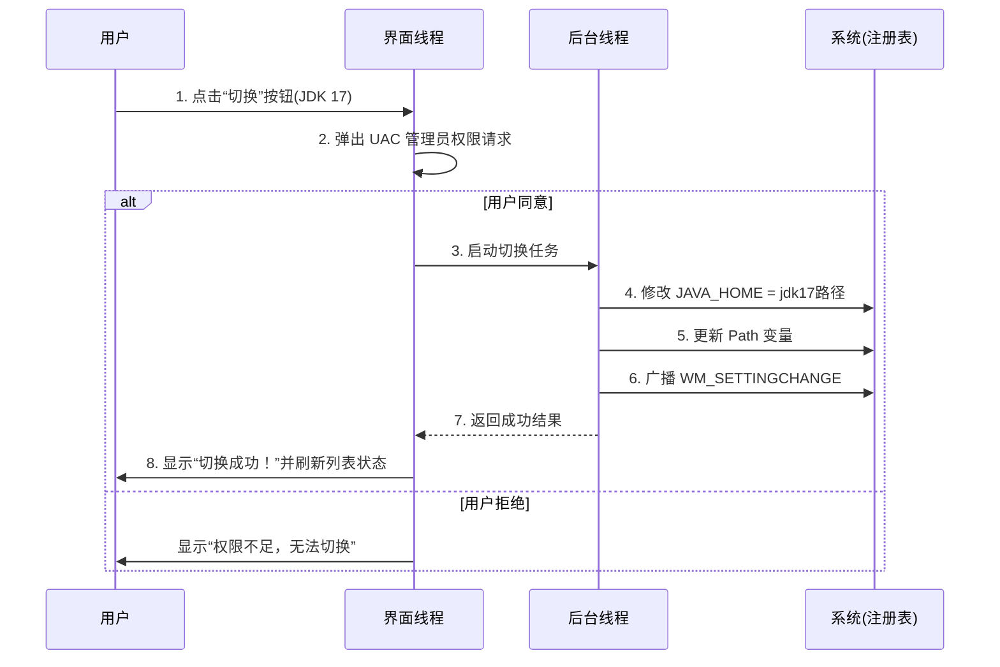

# 软件设计文档：Java Version Switcher (JVS) v1.0

| 文档版本 | 修改日期   | 作者   | 说明     |
| :------- | :--------- | :----- | :------- |
| 1.0      | 2026-07-14 | System | 初稿创建 |

## 1. 引言

### 1.1 项目背景
Windows 平台上现有的 Java 版本管理 GUI 工具（如 Java Version Switcher GUI）已长期未更新，且缺乏国内镜像加速支持。与此同时，Minecraft 启动器（如 HMCL、PCL2）和 Java 开发环境对多版本 JDK（如 Java 8、17、21）的切换需求日益迫切。本项目旨在开发一个**轻量级、开源、带有友好图形界面**的 Windows 原生 Java 版本管理工具。

### 1.2 项目目标
1.  **核心**：实现全局 `JAVA_HOME` 及 `Path` 环境变量的一键切换。
2.  **便捷**：自动扫描系统已安装的 JDK，并支持手动添加便携版 JDK。
3.  **加速**：内置从国内镜像站（华为云）下载 JDK 的能力。
4.  **兼容**：完美支持 Windows 10/11 系统（x64）。

## 2. 系统架构设计

### 2.1 总体架构图（逻辑视图）
系统采用 **分层架构 (Layered Architecture)**，分为表现层、业务逻辑层和数据访问层。

```mermaid
graph TD
    User[用户操作] --> UI[JavaFX 表现层 (UI)]
    UI --> Controller[控制器 (Controller)]
    
    Controller --> Scanner[JDK 扫描模块]
    Controller --> Switcher[版本切换模块]
    Controller --> Downloader[下载模块]
    
    Scanner --> LocalFS[本地文件系统扫描]
    Scanner --> Registry[Windows 注册表读取]
    
    Switcher --> EnvVar[环境变量操作模块 (JNA)]
    EnvVar --> WinAPI[Windows Kernel32/User32 API]
    
    Downloader --> Mirror[国内镜像源 (华为云)]
    
    Controller --> Config[本地配置管理 (JSON)]
    Config --> AppData[%APPDATA%/JVS/config.json]
```

### 2.2 技术栈选型

| 层级          | 技术选型                             | 理由                                                       |
| :------------ | :----------------------------------- | :--------------------------------------------------------- |
| **开发语言**  | Java 17+                             | 跨平台基础，利用现代语法，便于后续扩展                     |
| **UI 框架**   | **JavaFX 17+**（搭配 Scene Builder） | 相比 Swing 界面更现代，支持 CSS 美化，符合原生桌面应用审美 |
| **本地交互**  | **JNA (Java Native Access)**         | 反射调用 Windows DLL，无需编写 JNI 代码，实现环境变量广播  |
| **JSON 处理** | Jackson 或 Gson                      | 轻量级配置读写                                             |
| **HTTP 下载** | OkHttp 或 Java 原生 HttpClient       | 支持断点续传和超时控制                                     |
| **打包分发**  | **jpackage**（JDK 内置）             | 生成无依赖的 `.exe` 安装包，自动识别系统架构               |
| **日志系统**  | SLF4J + Logback                      | 便于记录操作日志，方便问题排查                             |

## 3. 详细模块设计

### 3.1 模块划分
系统包含以下 5 个核心模块：

#### 3.1.1 JDK 扫描模块 (`Scanner`)
-   **功能**：启动时自动检索系统中的所有 JDK。
-   **源**：
    1.  默认安装路径：`C:\Program Files\Java\`，`C:\Program Files (x86)\Java\`。
    2.  注册表路径：`HKLM\SOFTWARE\JavaSoft\JDK`（以及 32 位兼容路径）。
    3.  用户自定义路径（通过“添加”按钮）。
-   **验证**：检查路径下是否存在 `bin\java.exe`，并执行 `java -version` 获取准确版本号。

#### 3.1.2 环境变量操作模块 (`EnvironmentHelper`)
-   **功能**：核心底层模块，负责读写系统环境变量。
-   **逻辑**：
    -   **读取**：使用 JNA 读取注册表键值 `HKLM\SYSTEM\CurrentControlSet\Control\Session Manager\Environment`。
    -   **写入（切换）**：
        1.  修改 `JAVA_HOME` 为选中的 JDK 根路径。
        2.  操作 `Path` 变量：查找是否存在以 `%JAVA_HOME%\bin` 开头的项。若存在则替换；若不存在则插入到最前面，确保优先级最高。
        3.  **广播通知**：调用 `User32.INSTANCE.SendMessageTimeout(HWND_BROADCAST, WM_SETTINGCHANGE, 0, "Environment", ...)`，使资源管理器刷新，**无需重启电脑即可生效**。

#### 3.1.3 下载模块 (`Downloader`)
-   **功能**：解决用户“找不到合适 JDK”的痛点。
-   **来源**：优先使用**华为云镜像站**（`https://repo.huaweicloud.com/java/jdk/`）下载 Oracle JDK 或 OpenJDK。
-   **流程**：用户选择版本（如 17、21） -> 后台线程下载 ZIP/Tar.gz -> 自动解压到 `C:\Users\用户名\.jvs\jdk\` 目录 -> 自动扫描并添加到列表。

#### 3.1.4 配置管理模块 (`ConfigManager`)
-   **功能**：持久化用户设置和已知的 JDK 列表。
-   **存储路径**：`%APPDATA%\JavaSwitcher\config.json`。
-   **数据结构**：
    ```json
    {
      "jdkList": [
        {
          "name": "JDK 17.0.9",
          "path": "C:\\Program Files\\Java\\jdk-17.0.9",
          "version": "17.0.9",
          "vendor": "Oracle",
          "isPortable": false
        }
      ],
      "currentJdkPath": "C:\\Program Files\\Java\\jdk-17.0.9",
      "settings": {
        "autoScanOnStart": true,
        "mirrorUrl": "https://repo.huaweicloud.com/java/jdk/"
      }
    }
    ```

#### 3.1.5 权限提升模块 (`Elevation`)
-   **功能**：修改系统环境变量（`HKLM`）需要管理员权限。
-   **策略**：
    -   启动时检查当前进程是否以管理员身份运行。若不是，GUI 会显示提示，并提供“重启并提权”按钮。
    -   利用 `jpackage` 打包时配置 `win-console` 或通过 `ShellExecute` 调用自身并携带 `runas` 参数。

## 4. 用户界面设计 (UI/UX)

采用 **MVVM** 模式设计，界面风格遵循 Windows 11 现代设计语言（Fluent Design）。

### 4.1 主界面布局 (Main Window)
-   **顶部（标题栏区）**：Logo + “Java 版本切换器”标题 + “最小化/关闭”。
-   **中间（列表区 - ListView）**：
    -   展示所有扫描到的 JDK 版本。
    -   每个 Item 显示：版本号、发行商（如 Oracle/Zulu）、路径。
    -   **状态标记**：当前正在使用的版本高亮显示，并带有一个绿色小圆点或“当前使用”标签。
-   **底部（操作栏）**：
    -   **切换按钮**：选中一个版本后点击，触发切换（需要 UAC 弹窗）。
    -   **刷新按钮**：重新扫描系统。
    -   **添加按钮**：打开文件夹选择器，手动添加便携版 JDK。
    -   **下载按钮**：打开下载对话框，从国内镜像获取新版 JDK。

### 4.2 交互流程图（切换操作）


## 5. 关键算法与难点解决

### 5.1 Path 变量智能清洗（防冗余）
**痛点**：反复切换会导致 `Path` 变量越来越长，包含大量失效的 Java 路径。
**解决方案**：
1.  读取当前 `Path`，按 `;` 分割。
2.  过滤掉所有包含 `java`、`jdk`、`jre` 且指向原 JDK 目录的项。
3.  将新的 `%JAVA_HOME%\bin` 插入到列表的最前端。
4.  合并新列表并写回注册表。

### 5.2 下载解压进度反馈
-   使用 **异步任务**（`javafx.concurrent.Task`）处理下载。
-   通过 `updateProgress()` 和 `updateMessage()` 绑定 UI 进度条，避免界面卡死。

### 5.3 针对 Minecraft 的适配
-   **内置推荐标签**：在 JDK 列表项中，若版本为 Java 8、17 或 21（Minecraft 主流版本），自动添加 `[Minecraft]` 或 `[推荐]` 标签。
-   **JVM 参数建议**：下载模块中提供“一键下载 Zulu JDK 17”选项，因为 Zulu 在 Minecraft Mod 社区中兼容性极佳。

## 6. 安全性设计

1.  **最小权限原则**：仅在进行“切换”、“修改 Path”操作时请求管理员权限；浏览、扫描、下载等操作以普通用户权限运行。
2.  **输入校验**：对用户手动输入的路径进行严格校验，防止注入攻击（虽然本地应用风险较小，但路径遍历需检查）。
3.  **安装包签名**：使用 `jpackage` 打包时，建议开发者使用自签名证书或购买代码签名证书，避免 Windows Defender 报“未知应用”拦截。

## 7. 构建与部署方案

### 7.1 打包命令（jpackage 示例）
使用 Maven 插件或命令行：
```bash
jpackage --type exe \
  --input target/libs \
  --main-jar jvs-app.jar \
  --main-class com.jvs.App \
  --name "Java Version Switcher" \
  --win-console \
  --win-per-user-install \
  --icon src/main/resources/icon.ico
```

### 7.2 更新机制
-   **简易方案**：启动时访问 GitHub Releases（或 Gitee 国内镜像）检查最新版本号，若有更新，下载新的 `.exe` 并覆盖。
-   **静默更新**：下载完成后，生成一个 `.bat` 脚本关闭当前进程并替换文件，重启应用。

## 8. 测试要点（Test Cases）

1.  **兼容性测试**：确保系统原有 JDK 8（32位）和 JDK 21（64位）共存时，切换后 `java -version` 输出正确。
2.  **Path 长度测试**：当系统 `Path` 变量接近 2048 字符上限时，确保操作不会截断或丢失其他系统路径。
3.  **权限测试**：普通用户双击无 UAC 弹窗时，切换按钮是否置灰并给出明确提示。
4.  **Minecraft 实测**：切换至 Java 17 后，能否正常启动 Minecraft 1.20+ 版本。

## 9. 未来扩展规划 (Roadmap)

-   **v1.1**：支持 `.java-version` 文件解析，实现“进入特定文件夹自动切换 JDK”的 Shell 扩展。
-   **v1.2**：增加“环境变量备份/恢复”功能，防止误操作导致系统环境崩溃。
-   **v2.0**：集成 Minecraft 启动器 API，自动识别游戏版本所需的 Java 参数并切换。
