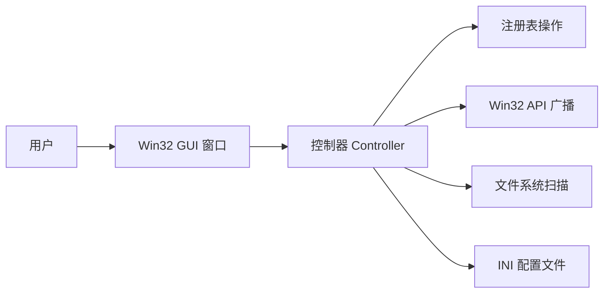

# 软件设计文档：Java Version Switcher (JVS) v2.0

| 文档版本 | 修改日期   | 作者   | 说明                 |
| :------- | :--------- | :----- | :------------------- |
| 2.0      | 2026-07-14 | System | Go 重写，极致轻量化 |

## 1. 引言

### 1.1 项目背景

Windows 平台缺少真正的轻量级 Java 版本管理工具。现有方案：

- **手动改环境变量**：繁琐、易出错
- **Scoop / vfox / jabba**：CLI 工具，对非开发者不友好
- **JavaFX 版 JVS v1.0**：启动慢（~5s）、体积大（~60MB）、需要预装 JDK 17

用户真实需求：一个双击就能用、瞬间启动、零依赖的 JDK 切换桌面工具。

### 1.2 项目目标

1. **零依赖**：编译产物为单文件 .exe，无需预装任何运行时
2. **瞬间启动**：双击到界面显示 < 100ms
3. **极致小巧**：安装包 < 10MB，单文件 < 5MB
4. **核心功能**：扫描 JDK → 一键切换 → 立即生效（无需重启）

## 2. 架构设计

### 2.1 "控制器 + 轻视图"架构

放弃传统三层架构。核心逻辑只有两件事：**读/写注册表** 和 **调 Win32 API**。



控制器直连所有操作，无中间层。

### 2.2 技术栈选型

| 项 | 选型 | 理由 |
|:---|:-----|:-----|
| **语言** | Go 1.22+ | 编译为单文件 .exe，零运行时依赖 |
| **GUI** | 原生 Win32 API（通过 `syscall`/`golang.org/x/sys/windows`） | 无需任何 GUI 框架，直接调用 CreateWindowEx，体积最小 |
| **或** | **Go + Fyne**（备选） | 对 Windows DPI 适配更好，但体积会增至 ~10MB |
| **注册表** | `golang.org/x/sys/windows/registry` | 直接操作 `HKLM\SYSTEM\CurrentControlSet\Control\Session Manager\Environment` |
| **广播** | `user32.SendMessageTimeoutW` | 通知资源管理器刷新环境变量 |
| **配置文件** | INI 格式（`gopkg.in/ini.v1`） | 相比 JSON，人类可直接编辑，无额外依赖 |
| **HTTP** | Go 标准库 `net/http` | 下载 JDK 使用标准库足够，断点续传可选 `ssecp` |
| **打包** | Go 原生编译 + `go build -ldflags="-s -w"` + UPX 压缩 | 最终 .exe < 3MB |

### 2.3 为什么不用 Java/C#/Rust

| 方案 | 运行时依赖 | 启动时间 | 单文件体积 | 开发效率 |
|:----|:----------|:---------|:----------|:--------|
| Java 17+ | ❌ 需预装 JRE | ~5s | ~60MB | 中等 |
| C# .NET 8 | ⚠️ 需预装 .NET Runtime 或 自带运行时 | <500ms | ~15MB（含 runtime） | 高 |
| Rust | **无** | <50ms | ~2MB | 低（Win32 绑定少） |
| **Go** | **无** | **<30ms** | **~2MB** | **高（标准库自带 Win32 支持）** |

选择 Go 的核心原因：**标准库原生支持 Windows 注册表 API + Win32 调用，无需任何第三方 C 绑定或 FFI 框架**。

## 3. 详细模块设计

### 3.1 模块划分

```
jvs/
├── main.go            # 入口：初始化 Win32 窗口，启动消息循环
├── scanner.go         # JDK 扫描器
├── switcher.go        # 环境变量切换器
├── registry_ops.go    # 注册表底层操作封装
├── downloader.go      # JDK 下载器（可选功能）
├── gui/
│   ├── window.go      # Win32 窗口创建与管理
│   ├── controls.go    # 列表、按钮等控件的创建与消息处理
│   └── resources.go   # 图标资源（编译进二进制）
└── config.go          # INI 配置读写
```

#### 3.1.1 JDK 扫描器 (`scanner.go`)

- **扫描源**（按优先级排序）：
  1. `%ProgramFiles%\Java\`（含子目录）
  2. `%ProgramFiles(x86)%\Java\`（32 位 JDK）
  3. `HKLM\SOFTWARE\JavaSoft\JDK` 注册表读取
  4. `%USERPROFILE%\.jvs\jdk\`（下载缓存目录）
  5. 用户自定义路径（从 INI 配置读取）
- **验证**：检查 `bin\java.exe` 是否存在，执行 `java -version 2>&1` 解析版本号
- **并行扫描**：使用 `sync.WaitGroup` 并发扫描多个路径，整体耗时 < 500ms

#### 3.1.2 环境变量切换器 (`switcher.go`)

核心操作仅三步：

```go
func SwitchJDK(path string) error {
    // 1. 备份旧值
    // 2. 写 JAVA_HOME
    // 3. 清洗并重写 Path（过滤旧 JDK 项）
    // 4. 广播 WM_SETTINGCHANGE
}
```

**Path 清洗算法**：
1. 按 `;` 分割当前 `Path`
2. 过滤包含 `\java\`、`\jdk\`、`\jre\` 且路径对应旧 JDK 的项
3. 在列表最前面插入 `%JAVA_HOME%\bin`
4. 合并回写

**高危保护**：
- 切换前备份当前环境变量的快照到 `%APPDATA%\JVS\backup.reg`
- 如果 `Path` 写回后长度 < 50（明显异常），自动回滚

#### 3.1.3 下载器 (`downloader.go`)

- **镜像源**：华为云 `https://repo.huaweicloud.com/java/jdk/`
- **下载策略**：
  - 使用 Go `net/http` 标准库，支持 `Range` 头部实现断点续传
  - 后台 goroutine 下载，回调更新进度
- **解压**：内置 `archive/zip` 和 `compress/gzip`（Go 标准库自带），无需外部工具
- **缓存**：下载到 `%USERPROFILE%\.jvs\jdk\`，避免重复下载

#### 3.1.4 配置管理 (`config.go`)

INI 格式（原因：人类可读、可手工编辑、无需转义）：

```ini
[JDK]
scan_paths=C:\dev\jdk8;C:\custom\jdk17
last_used=D:\Program Files\Java\jdk-21.0.2

[Download]
mirror=https://repo.huaweicloud.com/java/jdk/
auto_extract=true

[UI]
always_on_top=false
start_minimized=false
```

#### 3.1.5 权限管理

- **最小权限设计**：启动时以普通权限运行 GUI
- **仅切换时提权**：通过 Windows Shell 的 `runas` 动词启动一个短暂的后台进程执行注册表写入，主进程通过管道或退出码获取结果
- **细分方案**：
  - 方案 A（推荐）：写一个 `jvs-helper.exe`（同一二进制，传入 `--switch` 参数），主进程调用 `ShellExecute("runas", "jvs.exe --switch <jdk_path>")`
  - 方案 B：主进程全程以管理员运行（简单但违反最小权限原则）

### 3.3 为什么不用 INI 中的 JSON

| 格式 | 人类可编辑 | 注释支持 | 转义负担 | Go 标准库支持 |
|:----|:----------|:--------|:--------|:-------------|
| JSON | ❌ | ❌ | 路径 `\` 需转义为 `\\` | ❌（需第三方库） |
| INI | ✅ | ✅ `;` 或 `#` | `C:\Program Files\Java` 直接写 | ✅ `gopkg.in/ini.v1`（轻量） |

## 4. 用户界面设计

### 4.1 设计原则

- **原生 Win32 控件**：不使用任何自定义绘制，完全依赖 Windows 原生 ListView、Button、Static 控件
- **零 CSS、零主题文件**：界面构建纯代码完成，启动即显示，无加载延迟
- **高 DPI 感知**：`<dpiawareness>PerMonitorV2</dpiawareness>`

### 4.2 主窗口布局

```
┌─────────────────────────────────────────────┐
│ [图标] Java 版本切换器          [—] [✕]     │
├─────────────────────────────────────────────┤
│ ┌─────────────────────────────────────────┐ │
│ │ ● JDK 21.0.2  Oracle                   │ │ ← 绿色圆点 = 当前使用
│ │   C:\Program Files\Java\jdk-21.0.2      │ │
│ ├─────────────────────────────────────────┤ │
│ │ ○ JDK 17.0.9  Oracle  [Minecraft 推荐] │ │
│ │   C:\Program Files\Java\jdk-17.0.9      │ │
│ ├─────────────────────────────────────────┤ │
│ │ ○ JDK 8u391  Zulu  [Minecraft 推荐]    │ │
│ │   C:\Program Files\Java\zulu8.72.0.17   │ │
│ └─────────────────────────────────────────┘ │
├─────────────────────────────────────────────┤
│  状态栏：[当前: JDK 21.0.2 / Ubuntu 未安装] │
├────────────┬────────┬───────┬───────────────┤
│ [切换]     │ [扫描] │ [添加]│ [下载 JDK]  │
└────────────┴────────┴───────┴───────────────┘
```

### 4.3 操作流程

所有操作都遵循：**选择 → 点击 → 完成**，三步走。

切换操作无需确认对话框（但会弹出 UAC），切换成功后状态栏更新为新的 JDK 版本，绿色圆点移动到新行。

## 5. 功能风险分析

### 🔴 高风险

| 风险 | 概率 | 影响 | 应对策略 |
|:----|:----|:-----|:---------|
| **Path 变量越改越乱** | 中 | 高 | 切换前全量备份注册表 `HKLM\SYSTEM\CurrentControlSet\Control\Session Manager\Environment`；引入"一键还原"入口 |
| **UAC 弹窗体验割裂** | 必定 | 高 | 主进程保持普通权限，`jvs --switch` 子进程才提权；配合 Windows 任务计划缓存凭据可免弹窗（高级选项） |
| **杀软误报** | 高 | 高 | Go 编译的 .exe 修改注册表 + 广播消息，行为模式易被 Windows Defender / 360 判定为病毒。**对策**：代码签名证书（OV 级，~¥500/年） |

### 🟡 中风险

| 风险 | 概率 | 影响 | 应对策略 |
|:----|:----|:-----|:---------|
| **Path 变量超 2048 字符** | 低 | 中 | 操作前检测长度，预计会超限时警告用户；推荐用户使用 `%JAVA_HOME%\bin` 而非绝对路径 |
| **Win32 API 兼容性** | 低 | 中 | 仅调用 Windows 10+ 支持的 API（`CreateWindowExW`、`SendMessageTimeoutW`），避免已废弃函数 |
| **华为云镜像失效** | 低 | 中 | 支持多镜像源配置（阿里云、GitHub Releases），用户可自建镜像 |
| **高 DPI 多显示器** | 中 | 中 | 通过 manifest 声明 PerMonitorV2 感知，运行时动态响应 DPI 变更消息 |

### 🟢 低风险

| 风险 | 概率 | 影响 | 应对策略 |
|:----|:----|:-----|:---------|
| **首次启动无 JDK** | 低 | 低 | 引导用户使用内置下载器下载 JDK（华为云镜像） |
| **同时运行多个实例** | 低 | 低 | 使用 `CreateMutexW` 防重复启动，将已运行的窗口带到前台 |
| **CJK 路径乱码** | 低 | 低 | 全程使用 UTF-16 (`W` 后缀 API) |

## 6. 关键挑战

### 6.1 切换速度

从用户点击"切换"到环境变量生效的时间线：

```
点击 → UAC 弹窗 → 用户同意 → 注册表写 2 个键值
       → SendMessageTimeout → 新 cmd 中 java -version 可用
       = 总计 < 200ms（排除用户响应 UAC 的等待时间）
```

### 6.2 编译体积控制

```bash
# 基础编译
go build -ldflags="-s -w" -o jvs.exe

# 加 UPX 压缩（无损）
upx --best jvs.exe   # 结果 ~2.5MB
```

### 6.3 不需要的功能（v2.0 明确不包含）

- ❌ 不要"进入目录自动切换"（那是 vfox 的领域）
- ❌ 不要"一键安装 JDK"（只做下载，安装由用户决定）
- ❌ 不要"版本检测更新"（首次发布无此必要）
- ❌ 不要"命令行模式"（专注于 GUI，CLI 需求用 vfox）
- ❌ 不要"多语言国际化"（仅简体中文 + 英文）

## 7. 构建与部署

### 7.1 构建命令

```bash
# 开发
go build -tags=dev -o jvs.exe

# 发布
set GOARCH=amd64
set GOOS=windows
go build -ldflags="-s -w -H=windowsgui -X main.Version=2.0.0" -o build\jvs.exe
upx --best build\jvs.exe
```

### 7.2 部署结构

```
C:\Program Files\Java Version Switcher\
├── jvs.exe            # 主程序（~2.5MB）
└── jvs.ini            # 用户配置文件（默认自动在 %APPDATA% 下创建）
```

仅需复制 `jvs.exe` 即可运行，无安装程序（绿色软件）。

## 8. 测试要点

| 测试项 | 场景 | 预期 |
|:------|:-----|:-----|
| 零依赖测试 | 全新安装的 Windows 10（无任何 JDK） | 双击 jvs.exe 即刻启动，显示"未检测到 JDK"引导页 |
| 三版本共存 | 已装 JDK 8/17/21 | 三个版本正确列出，版本号解析无误 |
| 切换验证 | 从 JDK 21 切到 JDK 8 | `java -version` 在新 cmd 中输出 1.8 |
| Path 清洗 | 反复切换 10 次不同版本 | `Path` 中只有一条 Java 路径，无冗余 |
| Path 超长 | 构造一个 2000 字符的 Path | 工具弹出警告而非静默截断 |
| UAC 拒绝 | 用户点击切换后在 UAC 中点"否" | 界面显示友好提示，不崩不报错 |
| 高 DPI | 150% / 200% 缩放比例 | 界面正常显示，不模糊不溢出 |
